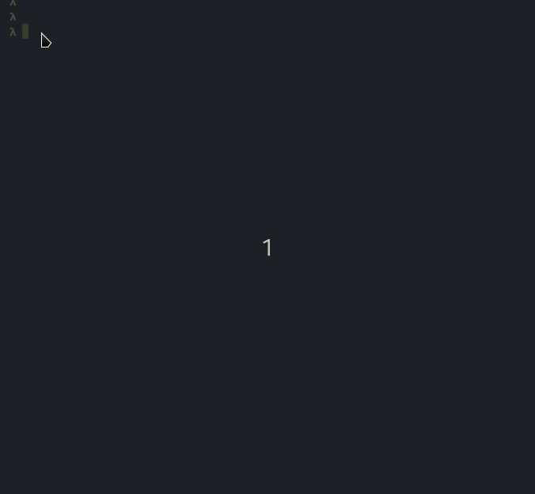

# Languages Bot

Este é um bot de recomendação, a partir de alguns questionamentos ele recomenda linguagens de programação ao usuário. Com isso, o usuário pode conhecer novas linguagens que se adaptam melhor ao problema e interesse do usuário. O bot pesquisa linguagens a partir deste [repositório](https://github.com/raulpy271/languagesDataset) com mais de 600 linguagens. 



# Executar

```
swipl prolog/languages_bot.pl
```
